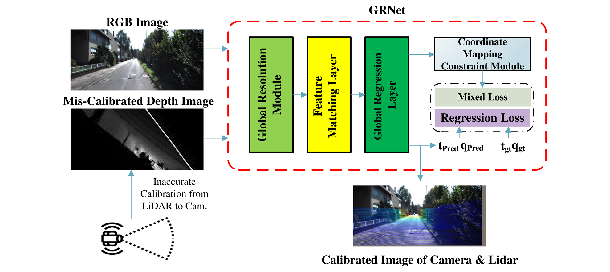
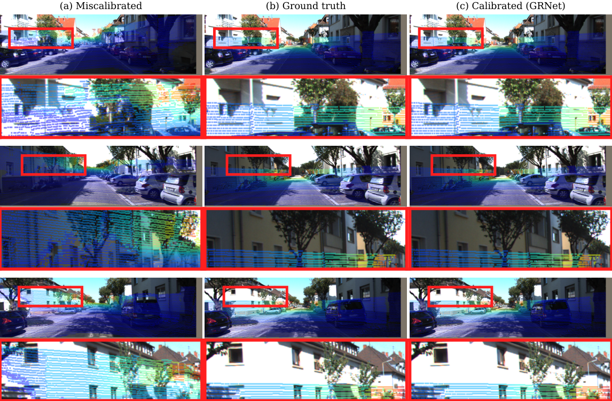
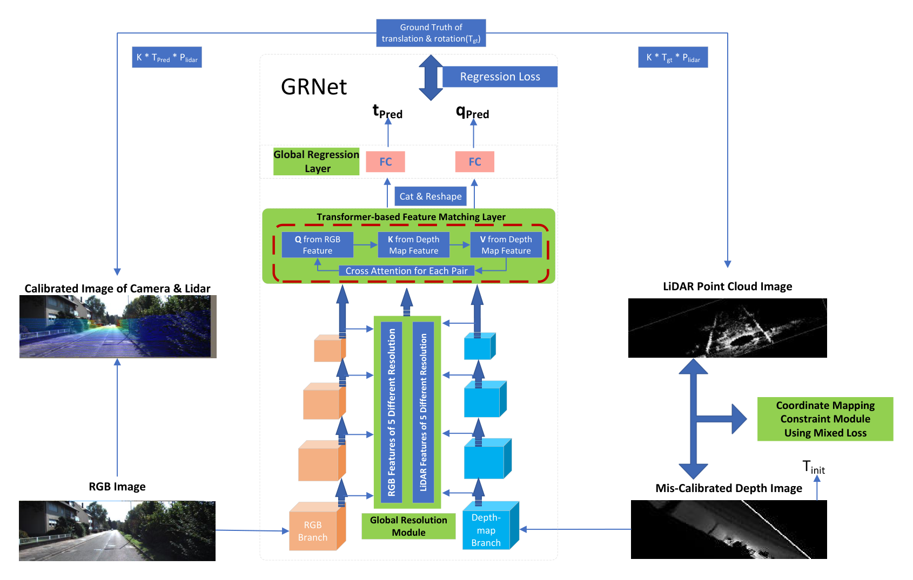

# GRNet

**GRNet: Global Resolution LiDAR-Camera Drift Correction Using Mixed Loss Network**

Official PyTorch code for GRNet, an end-to-end network for LiDAR–camera extrinsic drift correction.



On KITTI odometry sequence 00, GRNet reaches a mean absolute error of **0.3487 cm** in translation and **0.0382°** in rotation. The three-stage cascade corrects one frame in **148.56 ms** (6.73 FPS) on an RTX 3090.

## Qualitative results

KITTI sequence 00. Left: miscalibrated projection. Middle: ground truth. Right: GRNet.



## Network



## Installation

We run the project on CUDA 11.3 (PyTorch 1.11.0, Python 3.7).

#### **Step 1.** Create a conda virtual environment and activate it
```
conda create -n grnet python=3.7 -y
conda activate grnet
conda install pytorch==1.11.0 torchvision==0.12.0 torchaudio==0.11.0 cudatoolkit=11.3 -c pytorch
```

#### **Step 2.** Install GRNet
```
git clone https://github.com/Tommy620/GRNet-master.git
cd GRNet-master
pip install -r requirements.txt
```

#### **Step 3.** Download the weights from https://pan.baidu.com/s/1T3q1Ls6NtdF9D5UPBtVzng?pwd=IFNT Extract code: IFNT

Put the three cascade checkpoints under `weights/`:
```
weights/checkpoint_r5.00_t0.50.tar
weights/checkpoint_r2.00_t0.20.tar
weights/checkpoint_r1.00_t0.10.tar
```

## Data Preparation

Dataset: KITTI Odometry (color). The data folders are organized as follows:
```
├── data/
|   └── sequences
|       └── 00
|           └── image_2
|               └── 000000.png
|               └── ...
|           └── velodyne
|               └── 000000.bin
|               └── ...
```

## Evaluation

After the checkpoints are in `weights/` and KITTI is on disk, run:
```
python evaluate_calib.py with data_folder=/path/to/KITTI/dataset_color
```

Outputs go to `./outputs`. To point at checkpoints elsewhere:
```
python evaluate_calib.py with data_folder=/path/to/KITTI/dataset_color \
  weight="['./weights/checkpoint_r5.00_t0.50.tar','./weights/checkpoint_r2.00_t0.20.tar','./weights/checkpoint_r1.00_t0.10.tar']"
```

## Training

Change `data_folder` and `checkpoints` in `train_with_sacred.py` before running:
```
python train_with_sacred.py
```
Iterative training uses `max_r` / `max_t` (e.g. 5.0°/0.5 m, 2.0°/0.2 m, 1.0°/0.1 m).

## Citation

```
@article{wang2026grnet,
  title     = {GRNet: Global Resolution LiDAR-Camera Drift Correction Using Mixed Loss Network},
  author    = {Wang, Zi and Pan, Pingping and Li, You and Guo, Renzhong},
  journal   = {IEEE Sensors Journal},
  year      = {2026},
  note      = {under review}
}
```

## Contact

For questions about our paper or code, please contact wangzi@gml.ac.cn.
